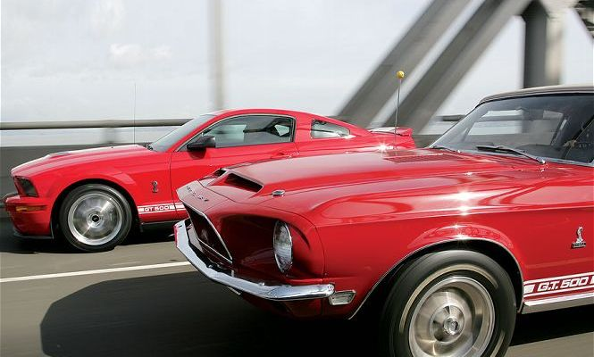

# Practica01-Mi-Blog
Proyecto de la creacion de un blog de Carros que hay en la actualidad, los que fueron tendencia, los formula 1 y un poco de historia 
# Estructura del Proyecto 🚀
La estructura del bloc esta realizado   en html 5 
# Contenido y Caracteristicas 
-Tematicas  
-Prototipos  
-Formula1  
-Actual  
-About  
-Home  
# Instalacion
Se debe tener instalado cualquier editor de html o tambien se puede usar el que viene por defecto que seria el bloc de notas.
Instalacion de Git para crear el repositorio en github
# Ejecutando las pruebas
Comandos para la actualizacion del repositorio  
git add .  
git commit -m "Creacion del proyecto"  
git push -u origin master  
# Estructura del html  
Actual.html  
contacto.html    
Formula1.html  
index.html  
Prototipos.html  
Tematicas.html  
Imagenes  
Menú de navegación que permitirá al usuario moverse entre todas las páginas HTML.  
        <nav>
            <ul>
                <a href="index.html">Home</a>
                <a href="contacto.html">About</a>
                <a href="Actual.html">Actual</a>
                <a href="Formula1.html">Formula1</a>
                <a href="Tematicas.html">Tematicas</a>
                <a href="Prototipos.html">Prototipos</a>
            </ul>
        </nav>  
La etiqueta <header> que contiene una imagen (logo) relacionada al tema elegido.  
<header>
      
   </header>  
la etiqueta <footer> deberá tener la información del estudiante como nombres completos, organización, correo (usar hipervínculo, mailto), teléfono (usar hipervínculo, tel), además deberá tener el símbolo de copyright junto a la leyenda de “Todos los derechos reservados”. Por ejemplo, © Todos los derechos reservados.    
<footer>  
      
Jonathan Atancuri , Organizacion: Universidad Politecnica Salesiana

      

Call: <a href="tel:+5939961424">(593) 996-1824</a> 

      
Email: <a href="mailto:jhotaggxz@gmail.com"> jhotaggxz@gmail.com</a>
   
      
&#169; Copyright 2019-2020 Todo los Derechos Reservados

    </footer>  
La tabla que esta dentro de la etiqueta article:  

   <section>
      <article>

            <table BORDER>
                    <caption>Autos </caption>
                 
                    <thead> <!-- Carros -->
                        <tr>
                            <th>Marca</th>
                            <th>Color</th>
                            <th>Año</th>
                        </tr>
                    </thead>
                 
                    <tfoot> <!-- Pie de tabla -->
                        <tr>
                            <th>Placa</th>
                            <th>País</th>
                        </tr>
                    </tfoot>
                 
                    <tbody> <!-- Cuerpo de la tabla -->
                        <tr>
                            <td>AUDI Q3 </td>
                            <td>Amarillo</td>
                            <td>2018</td>
                       </tr>
                       <tr>
                            <td>Audi R8</td>
                            <td>Amarillo</td>
                            <td>2018</td>
                        </tr>
                        <tr>
                            <td>Audi A1</td>
                            <td>Rojo</td>
                            <td>2019</td>
                        </tr>
                        <tr>
                            <td>BMW Serie 3</td>
                            <td>Azul</td>
                            <td>2019</td>
                        </tr>
                        <tr>
                            <td>BMW X2 M35i</td>
                            <td>Gris</td>
                            <td>2018</td>
                        </tr>
                        <tr>
                            <td>BMW Z4</td>
                            <td>Gris</td>
                            <td>2019</td>
                        </tr>
                    </tbody>
                 </table>
                 
      </article>      
   </section>  
  Etiqueta <iframe> para el video de youtube:  
<iframe width="560" height="315" src="https://www.youtube.com/embed/oHmZa_iYZz8" frameborder="0" allow="accelerometer; autoplay; encrypted-media; gyroscope; picture-in-picture" allowfullscreen></iframe>    
Manejo de listas desordenadas:    
<u><li>Azul Crescent Metalizado</li></u>
            <u><li>Negro Nightstar Perlado</li></u>
            <u><li>Gris Cynos Mate Metalizado</li></u>
            <u><li>Blanco Cool Mate Perlado (Honda)</li></u>
            <u><li>Amarillo Cool Mate Perlado (Honda)</li></u>    
Etiquetas de texto:    
Etiquetas de texto usadas:  
<strong>  

 <strong>Forza 300 </strong>La nueva Forza 300 comparte 
<mark>
<mark>lo que no exime que se haya podido pasar anadvertidas </mark>. Los fallos de uno mismo son siempre mucho más difíciles de detectar</li>    
                <li>Si piensas que la información  <mark>
<a>
<a href="index.html">Home</a>
<time>

<time datetime="2015-12-31 23:59">Nochevieja es el día 31</time>

<time datetime="2015-06-11">El verano comienza en junio</time>

<data>
<ul>
   <li><data value="10">Diez Km</data></li>
   <li><data value="20">Veinte Km</data></li>
   <li><data value="30">Treinta Km</data></li>
 </ul>  
 
Imagenes en rutas relativas:  
<section>
      <article>
              
            
<section>  
       <article>
         <header id="pagetop">
            <h2>Tendencia</h2>
            <h1>MERCEDES 300SL </h1>
              
            
 <article>
                <h1>About Us</h1>
                  
 <article>
                <h1>Catering</h1>
                  
 dos secciones (<section>) con tres artículos (<article>) cada sección. Luego, cada sección debe tener un encabezado (<header>), en donde, se ubicaran enlaces que permitan navegar entre los artículos usando id’s (ver, página 63 del texto guía).  
 <section>
      <article>
              
  <article>
                <h1>About Us</h1>  
      </article>  
             <a href="#pagetop">
Volver Arriba 
</a>
  
    </section>  
   Enlaces para navegar en la misma pagina entre artículos  
   <h1>Preguntas</h1>
        <ol>
            <li><a href="#faq1">Que motor diésel me recomienda instalar en una S10 año 1998?</a></li>
            <li><a href="#faq2">Que coche comprariais?</a></li>
            <li><a href="#faq3">Me gustaría saber que tan estable en carretera es la TRAX de chevrolet?</a></li>
            <li><a href="#faq4">Que pasa di tengo una entrada de aire de alto flujo pero un escape normal?</a></li>
            <li><a href="#faq5">¿Qué significa que se subió el agua del radiador?</a></li>  
        </ol>  
  <h2>Respuestas</h2>
        <h1 id="faq1">Que motor diésel me recomienda instalar en una S10 año 1998?</h1>
        
Un motor Cummins que vaya pasando de generación en generación y dure más en 
        la familia que el apellido del padre.
 
        <h1 id="faq2">Que coche comprarias?</h1>  
  <a href="#pagetop">
Volver Arriba 
</a>  
  

      
        

               
          

               
           

  
   

# Construido con 🛠️ :
HTML
# Autor ✒️
Jonathan Atancuri  
